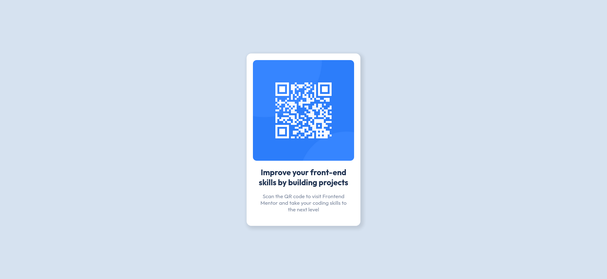

# Frontend Mentor - QR code component solution

This is a solution to the [QR code component challenge on Frontend Mentor](https://www.frontendmentor.io/challenges/qr-code-component-iux_sIO_H). Frontend Mentor challenges help you improve your coding skills by building realistic projects.

## Table of contents

- [Overview](#overview)
  - [Screenshot](#screenshot)
  - [Links](#links)
- [Built with](#built-with)
- [Author](#author)

## Overview

My first challenge attempted on Frontend Mentor. It's a perfect challenge for a complete beginner.

### Screenshot

### Links

- Solution URL: [https://www.frontendmentor.io/solutions/qr-code-component-erMa1_quCF](https://www.frontendmentor.io/solutions/qr-code-component-erMa1_quCF)
- Live Site URL: [https://adrianfloroiu.github.io/qr-code-component/](https://adrianfloroiu.github.io/qr-code-component/)

## Built with

- HTML5
- CSS
- Flexbox

## Author

- Frontend Mentor - [@adrianfloroiu](https://www.frontendmentor.io/profile/adrianfloroiu)
